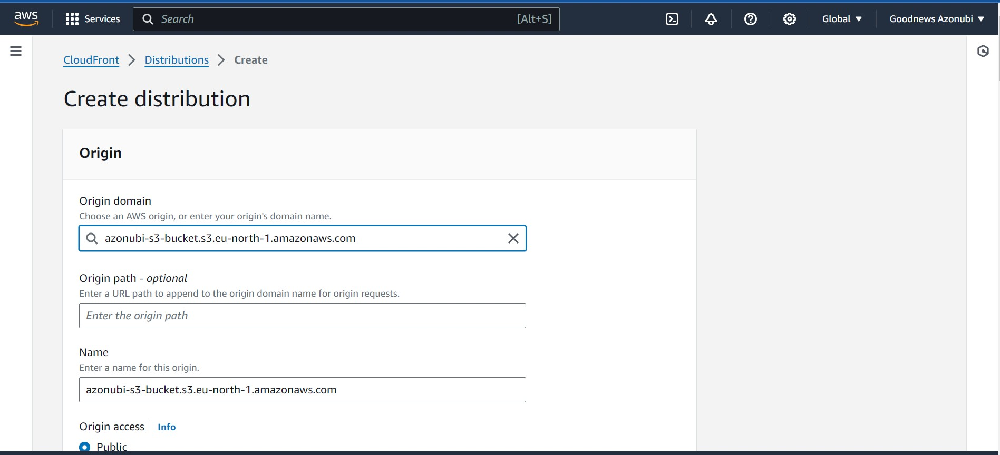

# Deploy a private s3 bucket static website using CloudFront

## `Objective:`

> Create a static website and host it on S3 bucket(private bucket) but with public read policy assigned, using cloud front for CDN.

## Overview Of Task Execution

- In this Document i'll outline the steps required to deploy a static website hosted on a private s3 bucket on AWS and using CloudFront as CDN to display the web contents

## Tasks:

## `s3 Bucket setup`

1. Login to your AWS account and search for `s3`

2. After clicking on the `s3` it will take you to a new page

> Then click on `Create bucket`

3. Enter a unique bucket name and click on `Create bucket`

> > The `Block public access` is what tells if your bucket is publicly or privately accessible. It blocks public access by default(private).

> Leave all default settings

4. Your bucket has been created now you can upload your static website files.

5. Click on your bucket name and then navigate to the `Upload` button to upload your files from your file explorer

> Now thats all we have to do for now.

## `Lets configure our CloudFront to render our website files`

6. Search for CloudFront and click on it

> You will be taken to a new page and then click on `Create a CloudFront distribution`

7. Click on the `Origin domain` text area
   > Your s3 bucket name should pop up for you to select

8. After selecting your bucket name scroll down to `Origin access` and select `Origin access control settings(recommended)`

> Click on `Create new OAC` and select your bucket name if your s3 bucket name does not appear on the dropdown options then click on create

> > This will create a policy you can attach to your s3 bucket policy permission so CloudFront can read your website contents and serve them.

> > Sroll down and click on `Create distribution`

9. Our CloudFront distribution has been created. Now let's copy the policy that will give CloudFront access to read our s3 bucket static website files. Click on `Copy Policy`

10. Let's go back to our s3 bucket permissions tab

> Search for `Bucket policy` and click on `Edit`

> > Now paste the policy you just copied and save

11. Go back to your created CloudFront distribution and copy your `distribution domain name`

12. Paste on your browser to view your static website

